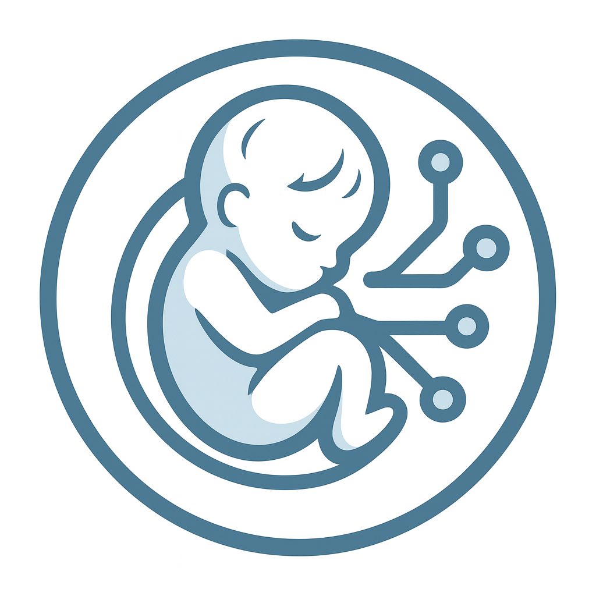
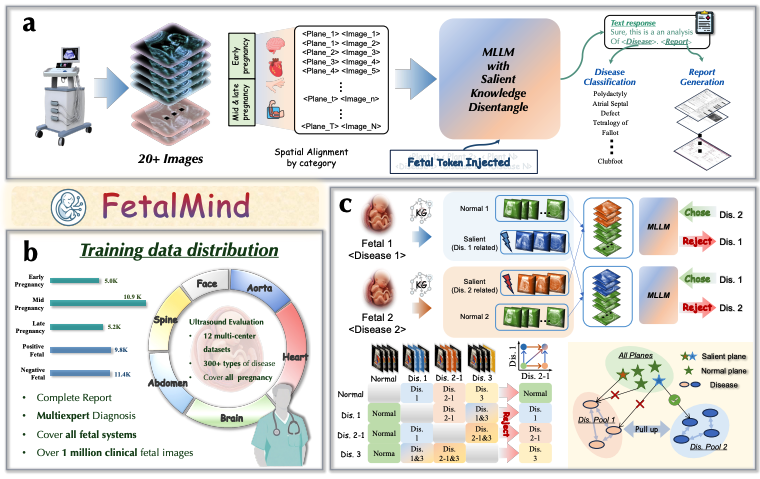
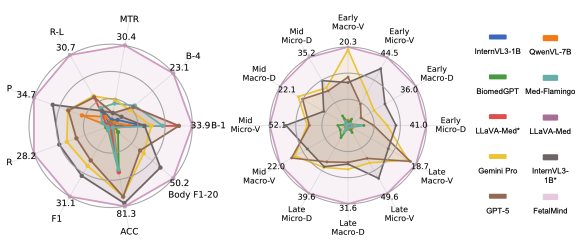

    

<h1 align="center"> FetalMind: Epistemic-aware Vision–Language Foundation Model for Fetal Ultrasound Interpretation</h1>

<h4 align="center"><em>Xiao He, Huangxuan Zhao✉, Guojia Wan, Yanxing Liu </em></h4>

<h4 align="center"><em>Juhua Liu, Yongchao Xu, Yong Luo, Dacheng Tao, Bo Du✉</em></h4> 

    

\* *Equal Contribution* &nbsp; &nbsp; Corresponding Author ✉

    
    <!--  -->
    <a href="https://jianchengpan.space/EarthSynth-website/index.html">"></a>
    
    
    

  <a href="#news">News</a> |
  <a href="#abstract">Abstract</a> |
  <a href="#dataset">Dataset</a> |
  <a href="#model">Model</a> |
  <a href="#statement">Statement</a>

## News
- [2025/10/16] The paper and project report have been released.

- [2025/10/15] We are actively working to obtain the necessary approvals for dataset release and plan to make a partially de-identified version publicly available after the paper is accepted.

## Abstract

A fetal vision–language foundation model, **FetalMind**, pretrained on multi-center fetal ultrasound data, integrating structured clinical knowledge and reinforcement learning for report generation and diagnostic reasoning across diverse gestational stages.

    

    

### Citation

